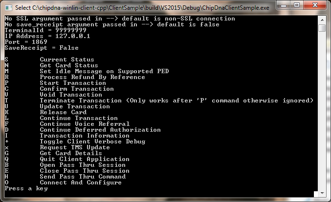
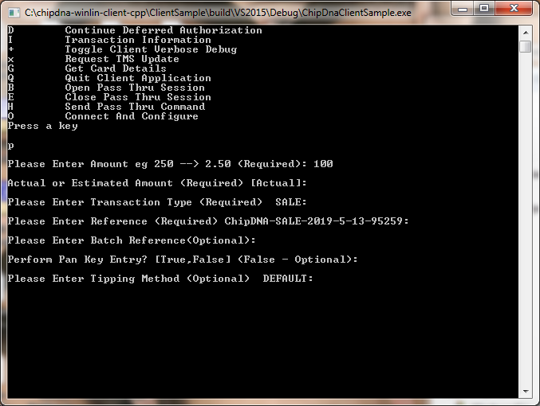

# chipdna-winlin-client-cpp
C++ client for ChipDNA
This client library gives developers a secure TCP/IP interface to ChipDNA server, and is designed for integration with a Point of Sale solution. This repository contains source code for both the C++ client library and an interactive sample client executable. 

## Setup
### Visual Studio
The Visual Studio 2015 solution will build the client library and the sample client. Both projects will require the following libraries:
* OpenSSL v1.0.1j
* pthreads v2.9.1
The full archives should be extracted to the directory specified in the `ChipDnaClientSample` and `LibChipDnaCpp` projects (by default `ChipDnaClient\SampleClient\deps`)

### GCC
Both projects are supplied with a makefile calling GCC on a Linux host. Note that the `ChipDnaClientSample` build script depends on the build output from `LibChipDnaCpp`
The Makefile assumes that the OpenSSL and POSIX Threads (pthreads) development packages are installed including headers, library files and any of their dependencies. If you receive a compile time error in regards to missing system header files please double check this. You may be able retrieve these using a package manager associated with your distribution.

## Running the Sample Client
* Establish that an instance of ChipDNA is running and available from the network location where you are going to run the client.
* Open `client.config.xml` in the sample client build output directory and populate the `Server` field with the `<ip>:<port>` of the ChipDNA server instance. Populate the `TerminalId` or the `ApiKey` field as required.
* Run the `ChipDnaClientSample` executable, if your client configuration was correct and a connection you'll be presented with the help menu, which can be invoked between commands by entering any key not listed.
  
* For every command you will be asked to enter the parameters individually (with the default values in parentheses). For details on the possible values these Parameters can take, read the `ParameterKeys` and `ParameterTokens` pages in the client library API documentation
  

## Documentation
The client library uses doxygen for API documentation. You can generate documentation with the command: 
`doxy ~/ChipDnaClient/ClientLib/docs/Doxygen`